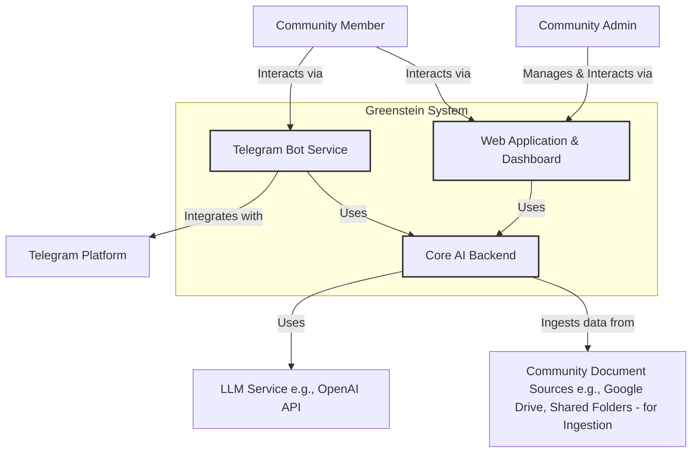
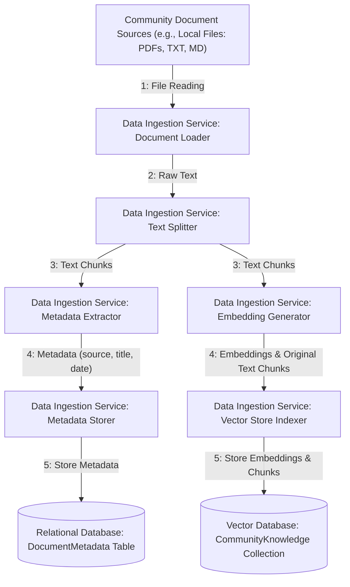
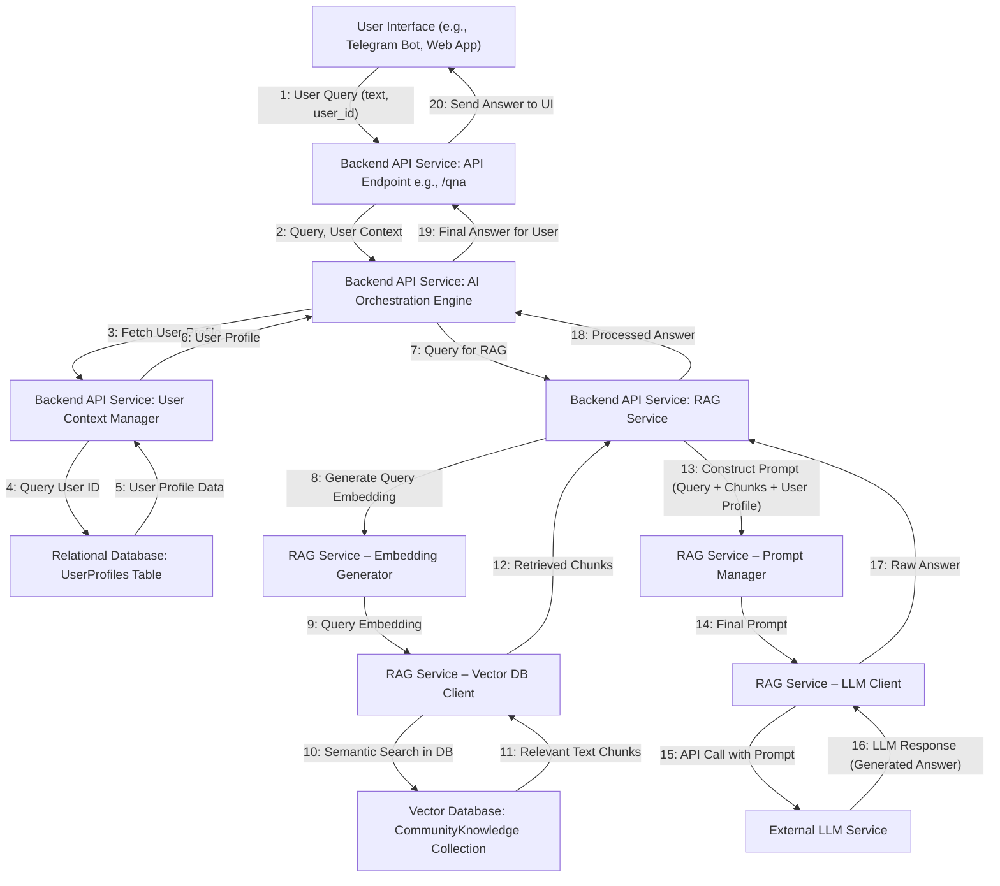
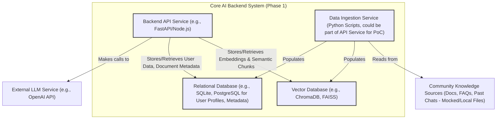
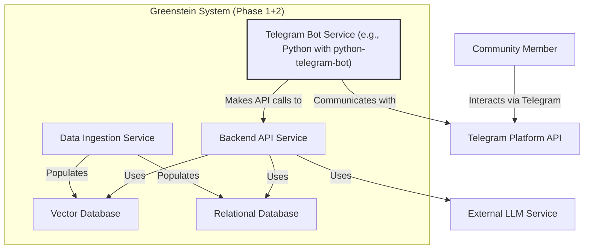
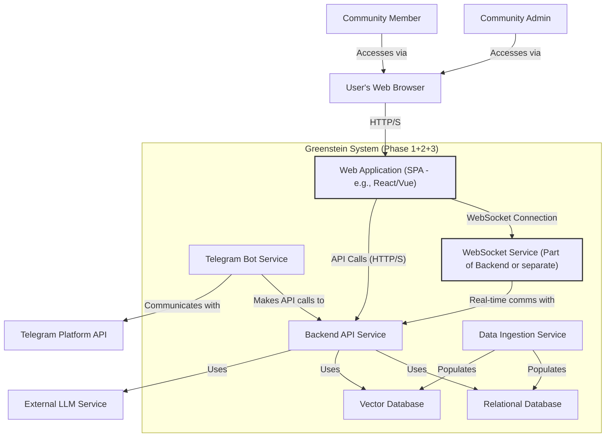

### 1. Introduction

### 1.1. Project Vision

Greenstein aims to be an AI-powered community platform. It starts with a robust AI backend for information management and agentic capabilities, exposes these via external bots (e.g., Telegram), and culminates in a rich native web application for direct user engagement and community administration.

### 1.2. Architectural Goals

- **Modularity:** Components should be independently developable and deployable to facilitate parallel work and easier maintenance.
- **Scalability:** The architecture should be designed to handle a growing number of users, messages, and documents conceptually, even if the initial implementation is for a PoC.
- **Maintainability:** A clear separation of concerns between services (e.g., API vs. Bot vs. Web App) will make the system easier to understand, debug, and update.
- **Extensibility:** The design should allow for the future addition of new features (e.g., new agentic capabilities, new bot integrations) with minimal disruption to existing components.
- **Security:** Foundational security practices will be implemented to ensure the integrity and confidentiality of data and communications.

### 1.3. Phased Development Approach

1. **Phase 1: Core AI Backend:** Build the central intelligence or "brain" of the system, focusing on APIs, the RAG pipeline, and core business logic.
2. **Phase 2: External Bot Integration:** Extend the reach of the AI Core to users on existing platforms by building an intelligent bot intermediary for Telegram.
3. **Phase 3: Native Web Application:** Provide a dedicated community hub and dashboard, offering the richest user experience and administrative control.

---

### 2. Overall System Context (C4 Level 1)

This diagram shows the Greenstein system in relation to its users and key external systems. It defines the system's boundary and its high-level interactions.

---

### 3. Data Flow Architecture

This section details the movement of data through the Greenstein system.

### 3.1. Data Ingestion Flow

This flow describes how knowledge from community documents is processed and stored for later retrieval by the AI.

**Description:**

1. **File Reading:** The `Document Loader` in the `Data Ingestion Service` reads raw files from specified sources.
2. **Raw Text Provision:** The extracted raw text is passed to the `Text Splitter`.
3. **Chunking & Metadata Path:** The `Text Splitter` divides the text into semantically relevant chunks, which are sent to both the `Embedding Generator` and `Metadata Extractor`.
4. **Embedding & Metadata Generation:** The `Embedding Generator` converts text chunks into vector embeddings, while the `Metadata Extractor` pulls metadata (e.g., source filename, title).
5. **Storage:** The `Vector Store Indexer` stores embeddings and their original text in the `Vector Database`. The `Metadata Storer` saves the extracted metadata in the `Relational Database`.

### 3.2. User Interaction & AI Processing Flow (Q&A Example via API)

This flow describes how a user query is processed to generate an AI response.

**Description:**

1. **User Query:** A user submits a query through an interface to a `Backend API Service` endpoint.
2. **Orchestration:** The API endpoint routes the request to the `AI Orchestration Engine`.
3. **Context Fetching:** The `Orchestrator` fetches the user's profile from the `Relational Database` via the `User Context Manager`.
4. **RAG Initiation:** The `Orchestrator` passes the query and user context to the `RAG Service`.
5. **Retrieval:** The `RAG Service` converts the query to an embedding and performs a semantic search in the `Vector Database` to find relevant text chunks.
6. **Generation:** A detailed prompt is constructed containing the user query, retrieved chunks, and user profile information. This is sent to the `External LLM Service`.
7. **Response Delivery:** The LLM's generated answer is processed and sent back through the layers to the user interface.

---

### 4. Phase 1: Core AI Backend Architecture

### 4.1. Conceptual Overview (Phase 1)

This phase focuses on building the central intelligence of Greenstein. It involves creating robust APIs for core functionalities (Q&A, summarization, categorization), implementing a Retrieval Augmented Generation (RAG) pipeline to ground the AI in community-specific knowledge, and managing user context and data. It is the foundational "brain" upon which all other services will rely.

### 4.2. Container Diagram (C4 Level 2 - Phase 1)

### 4.3. Detailed Component Breakdown (Phase 1)

*(Nested view of components within the Phase 1 containers)*

**A. `Backend API Service` (Container)**

- **A.1. `API Endpoints`:** Exposes HTTP/S endpoints (e.g., `/qna`, `/summarize`) and routes requests.
- **A.2. `AI Orchestration Engine`:** Central coordinator that manages the workflow for processing API requests.
- **A.3. `RAG Service`:** Implements the core RAG pipeline (query embedding, vector search, context building, LLM prompt generation, response processing).
- **A.4. `LLM Integration Client`:** Abstracted client for communicating with `External LLM Services`.
- **A.5. `User Context Manager`:** Retrieves user-specific data from the `Relational Database`.
- **A.6. `Prompt Management Service`:** Stores and retrieves prompt templates.
- **A.7. `Agentic Primitives Library`:** A collection of reusable functions for complex tasks (e.g., `extract_entities`).
- **A.8. `AuthN/AuthZ Service (Mocked)`:** Placeholder for user authentication and authorization.

**B. `Vector Database` (Container)**

- **B.1. `CommunityKnowledge Collection`:** Stores vector embeddings of text chunks.

**C. `Relational Database` (Container)**

- **C.1. `UserProfiles Table`:** Stores user information (roles, interests).
- **C.2. `DocumentMetadata Table`:** Stores metadata about ingested documents.

**D. `Data Ingestion Service` (Container)**

- **D.1. `Document Loader`:** Reads various document formats.
- **D.2. `Text Splitter`:** Divides texts into smaller chunks.
- **D.3. `Embedding Generator`:** Converts text chunks into vector embeddings.
- **D.4. `Metadata Extractor`:** Extracts metadata from documents.
- **D.5. `Vector Store Indexer`:** Writes embeddings to the `Vector Database`.
- **D.6. `Metadata Storer`:** Writes metadata to the `Relational Database`.

### 4.4. Key Technologies & Patterns (Phase 1)

- **Backend Framework:** FastAPI (Python) for its performance and auto-documentation.
- **LLM API:** OpenAI GPT-3.5/4 or Anthropic Claude.
- **Vector Database:** ChromaDB or FAISS for local, in-memory PoC development.
- **Embedding Model:** Sentence Transformers (e.g., `all-MiniLM-L6-v2`) for local, high-performance embeddings.
- **RAG Implementation Pattern:** Using core concepts from LangChain for document loading, splitting, embedding, retrieval, and chaining LLM calls.

---

### 5. Phase 2: External Bot Integration Architecture (Telegram)

### 5.1. Conceptual Overview (Phase 2)

This phase extends the Core AI Backend's capabilities to users on external chat platforms. The Telegram Bot acts as a secure and intelligent intermediary, translating user interactions into API calls to the core service and formatting the AI-generated responses for the chat medium.

### 5.2. Container Diagram (C4 Level 2) - With Bot Integration

### 5.3. Detailed Component Breakdown (Phase 2)

*(Nested view of the `Telegram Bot Service` container)*

**A. `Telegram Bot Service` (Container)**

- **A.1. `Telegram API Client Interface`:** Uses a library to handle low-level communication with the Telegram Bot API.
- **A.2. `Incoming Message Router/Dispatcher`:** Receives updates and routes them to the appropriate handler (text, command).
- **A.3. `Text Message Handler`:** Processes regular text messages, forwarding them to the `Backend API Client`.
- **A.4. `Command Handler`:** Parses and processes bot commands (e.g., `/summarize`, `/help`).
- **A.5. `Backend API Client (Bot-Side)`:** Makes HTTP/S requests to the `Core AI Backend Service`.
- **A.6. `Response Formatter`:** Formats backend responses for optimal display in Telegram (e.g., using Markdown).
- **A.7. `User ID Mapper`:** Maps Telegram User IDs to internal Greenstein user identifiers for context.
- **A.8. `Session/State Manager (Bot-Side)`:** Manages basic conversational state for multi-turn commands.

### 5.4. Key Technologies & Patterns (Phase 2)

- **Bot Framework:** `python-telegram-bot` for robust and idiomatic Python integration with Telegram.
- **Secure Communication:** Enforcing HTTPS for all API calls to the backend and using API keys for service authentication.
- **State Management:** Simple in-memory dictionaries keyed by user ID for PoC-level session management.

---

### 6. Phase 3: Native Web Application & Dashboard Architecture

### 6.1. Conceptual Overview (Phase 3)

This phase provides a dedicated, rich web interface for community members and admins. It offers a superior user experience with direct, real-time chat with the AI steward, personalized dashboards, and administrative functions, all powered by the same Core AI Backend.

### 6.2. Container Diagram (C4 Level 2) - With Web Application

### 6.3. Detailed Component Breakdown (Phase 3)

*(Nested view of the `Web Application` and `WebSocket Service` containers)*

**A. `Web Application (SPA - Single Page Application)` (Container - Runs in Browser)**

- **A.1. `UI Framework & Component Library`:** Base framework (e.g., React) and reusable UI components.
- **A.2. `Routing Module`:** Manages client-side navigation between views (`/dashboard`, `/chat`).
- **A.3. `Global State Manager`:** Manages shared application state (e.g., logged-in user).
- **A.4. `Authentication Module (Client-Side)`:** Handles login forms and token management.
- **A.5. `View Components`:**
    - `DashboardView`: Displays community highlights and AI summaries.
    - `AIChatView`: Provides the real-time chat interface.
    - `AdminPanelView`: Contains administrative tools.
- **A.6. `Backend API Client (Web)`:** Service module (e.g., using `axios`) for making HTTP requests to the Backend.
- **A.7. `WebSocket Client (Web)`:** Establishes and manages the real-time WebSocket connection.

**B. `WebSocket Service` (Container)**

- **B.1. `WebSocket Connection Manager`:** Handles and manages active WebSocket connections.
- **B.2. `Message Broker Interface`:** Routes incoming messages from clients to the backend processing logic and relays responses back to the correct client.

### 6.4. Key Technologies & Patterns (Phase 3)

- **Frontend Framework:** React for its component model and large ecosystem.
- **State Management:** Zustand or Redux Toolkit for efficient and scalable state management.
- **Real-time Communication:** [Socket.IO](http://socket.io/) for its simplicity and robustness in handling WebSockets.
- **Styling:** Tailwind CSS for rapid, utility-first styling.

---

### 7. Cross-Cutting Concerns

### 7.1. Security Considerations

- **Input Sanitization:** All user-provided input from any interface will be sanitized before being processed or included in LLM prompts to mitigate prompt injection attacks.
- **API Key Management:** API keys for external services (LLM, Telegram) will be stored securely as environment variables and not be exposed client-side.
- **Authentication & Authorization (PoC):** While mocked for the hackathon, a real system would implement robust AuthN (e.g., JWT) and AuthZ (role-based access control) for all API endpoints.

### 7.2. Scalability & Performance

- **Stateless Services:** The `Backend API Service` and `Telegram Bot Service` will be designed to be stateless, allowing for horizontal scaling by running multiple instances.
- **Asynchronous Processing:** Data ingestion and other potentially long-running tasks will be designed as asynchronous background processes to avoid blocking user-facing APIs.
- **Database Optimization:** Use of appropriate indexing on the `Relational Database` and efficient data structures in the `Vector Database`.
- **Caching:** A caching layer (e.g., Redis) could be introduced in a production system to cache frequent queries or expensive AI-generated responses.

---

### 8. Deployment View (Conceptual)

This describes how the system's components would be deployed in a containerized environment.

- **Containerization:** The `Core AI Backend Service`, `Telegram Bot Service`, and `WebSocket Service` will each be packaged as a Docker container.
- **Databases:** The `Vector Database` (ChromaDB) and `Relational Database` (PostgreSQL) can also be run as Docker containers for easy local setup.
- **Web Application:** The `Web Application (SPA)` will be built into a set of static assets (HTML, CSS, JS) that can be hosted on a static web host like Netlify, Vercel, or AWS S3.
- **Orchestration (Production):** In a production environment, a system like Docker Compose (for single-machine setups) or Kubernetes (for scalable clusters) would be used to manage and orchestrate these containers. For the hackathon, they can be run locally as separate processes.

---

### 9. Conclusion

This architecture document outlines a phased, modular, and comprehensive plan for developing the Greenstein. By leveraging established RAG patterns for a robust AI core, secure bot integration techniques for broad accessibility, and modern web application frameworks for a rich user experience, this project aims to deliver an intelligent and engaging community hub. The clear separation of concerns and phased approach allow for focused development, parallel workstreams, and the iterative delivery of value, culminating in a powerful and extensible platform.